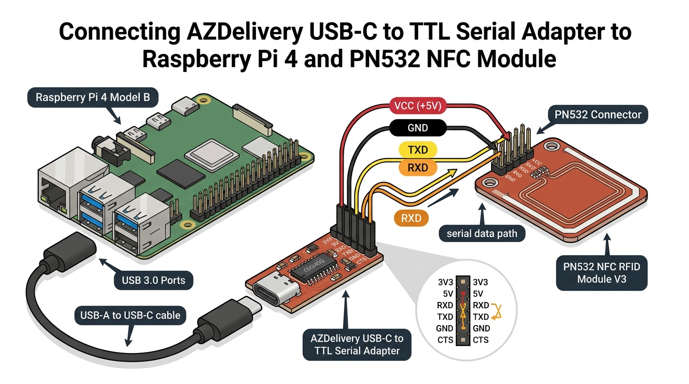

# 🛠️ Raspberry Pi Hardware & OS Setup Guide

Complete step-by-step setup guide for both Raspberry Pi units in the **Kinder-Supermarkt** system, including display troubleshooting, enclosure constraints, and NFC reader hardware options.

---

## 📐 Architecture Overview

| Device | Role | Recommended OS | Connected Hardware | Default Access URL |
|---|---|---|---|---|
| **Raspberry Pi #1** | Backend Server (Flask, SQLite, Docker) | **Raspberry Pi OS Lite (64-bit)** | USB Thermal Receipt Printer | `http://<pi1-ip>:5050` |
| **Raspberry Pi #2** | NFC Reader & Touchscreen Terminal | **Raspberry Pi OS Desktop (64-bit)** | Touchscreen Display + PN532 NFC Module | `http://<pi1-ip>:5050/terminal` (Kiosk Mode) |
| **Tablet** | Cashier UI | Any OS (iOS / Android / Windows) | Web Browser | `http://<pi1-ip>:5050` |

---

## 🍓 Raspberry Pi #1 — Backend Server Setup

### 1. Flash OS
1. Download & open **Raspberry Pi Imager**.
2. Select OS: **Raspberry Pi OS Lite (64-bit)** (headless, no desktop GUI needed).
3. Click gear icon ⚙️ (OS Customization):
   - Set Hostname: `supermarket-server`
   - Enable SSH (with password or public key)
   - Set username & password (e.g. `pi` / your password)
   - Configure Wi-Fi / LAN settings
   - Set Timezone: `Europe/Berlin`
4. Flash SD card & insert into Pi #1.

### 2. Install Docker & Docker Compose
SSH into Pi #1 (`ssh pi@supermarket-server.local` or via IP):

```bash
# Update system
sudo apt update && sudo apt upgrade -y

# Install Docker via official script
curl -fsSL https://get.docker.com -o get-docker.sh
sudo sh get-docker.sh

# Add user to docker group (run without sudo)
sudo usermod -aG docker $USER

# Install git
sudo apt install -y git

# Reboot to apply group permissions
sudo reboot
```

### 3. Deploy Application
After rebooting and logging back in:

```bash
# Clone the repository
git clone https://github.com/Ayakashi97/kids-supermarket.git
cd kids-supermarket

# Create environment configuration
cp .env.example .env

# Start container via Docker Compose
docker compose up -d
```

### 4. Connect USB Printer
1. Connect Epson (or compatible ESC/POS) USB thermal printer via USB cable.
2. Verify system detects printer:
   ```bash
   ls -l /dev/usb/lp*
   ```
3. If `/dev/usb/lp0` is present, update `.env` if needed:
   ```env
   PRINTER_DEVICE=/dev/usb/lp0
   ```

---

## 💳 Raspberry Pi #2 — NFC Reader & Touchscreen Terminal Setup

### 1. Flash OS
1. Open **Raspberry Pi Imager**.
2. Select OS: **Raspberry Pi OS with Desktop (64-bit)** (desktop environment required for touchscreen kiosk display).
3. Click gear icon ⚙️ (OS Customization):
   - Set Hostname: `supermarket-terminal`
   - Enable SSH
   - Set username & password
   - Configure Wi-Fi / LAN settings
4. Flash SD card & insert into Pi #2.

---

## 🔌 Enclosure & Case Options: Connecting NFC when a 3.5" Screen Occupies the 40-Pin Header

When using an enclosure/case where a 3.5" Touchscreen Display plugs flush onto all 40 GPIO pins, Dupont jumper wires cannot fit on top of the header pins inside the case. Here are the 4 best hardware options:

---

### Option 1: Use a USB-to-TTL Adapter with your existing PN532 Module (Recommended)
You can connect your existing PN532 module into one of Pi #2's **external USB ports** using a $2 USB-to-TTL Serial Adapter (AZDelivery / CP2102 / PL2303 / FT232):



1. Set PN532 DIP Switches to **HSU Mode**: `SEL0 = 0 (LOW / OFF)`, `SEL1 = 0 (LOW / OFF)`.
2. Connect PN532 pins to the USB Serial Adapter:
   - `VCC` ➡️ `5V` (Set jumper on AZDelivery adapter to **5V**)
   - `GND` ➡️ `GND`
   - `TX`  ➡️ `RX`
   - `RX`  ➡️ `TX`
3. Plug a standard USB-C to USB-A cable from the AZDelivery adapter into **any USB port on Raspberry Pi #2**! The 40-pin GPIO header remains 100% free inside the case for the 3.5" touchscreen.

---

### Option 2: Use a Plug-and-Play USB NFC Reader Stick
Instead of a raw GPIO board, use a USB NFC reader stick:
1. **USB HID / Keyboard Emulation NFC Reader**:
   - *Examples*: R80UF, JustID, or NeosID 13.56MHz USB NFC Dongle.
   - **Advantage**: Plugs into USB port. When a card is scanned, it automatically types the UID into the terminal view. No GPIO wiring or special libraries needed.
2. **ACR122U USB Smart Card Reader**:
   - Industry-standard USB NFC smart card reader (plugs into USB port).

---

### Option 3: Low-Profile GPIO Ribbon Extension Cable
If you want to keep GPIO communication:
- Use a flat 40-pin GPIO ribbon cable with a 90-degree low-profile female header.
- The ribbon cable fits between the Pi PCB and the 3.5" screen header, extending the 40 pins outside the case to a breakout board.

---

### Option 4: Solder 4 Wires to the Underside of the Raspberry Pi PCB
If mounting the PN532 inside or flush against the enclosure:
- Solder 4 thin enamel wires directly to the bottom pads of GPIO **Pin 3 (SDA)**, **Pin 5 (SCL)**, **Pin 2 (5V)**, and **Pin 9 (GND)** on the underside of the Raspberry Pi PCB board.

---

### 🖥️ Touchscreen Setup & White Screen Fix (3.5" XPT2046 Display)

If your 3.5" touchscreen displays a **solid white screen** on boot:

```bash
# SSH into Pi #2
ssh pi@supermarket-terminal.local

# Clone official LCD-show driver repo
git clone https://github.com/goodtft/LCD-show.git
chmod -R 755 LCD-show
cd LCD-show/

# Run installer script for 3.5" XPT2046 SPI display (auto-configures SPI, overlays & reboots)
sudo ./LCD35-show
```

---

### 3. Enable I2C & SPI Interfaces on Pi #2
SSH into Pi #2:

```bash
sudo raspi-config
```
- Go to `Interface Options` → `I2C` → Enable `Yes`.
- Go to `Interface Options` → `SPI` → Enable `Yes`.
- Reboot: `sudo reboot`.

Verify I2C detection:
```bash
sudo apt install -y i2c-tools
sudo i2cdetect -y 1
```
*(You should see `0x24` listed for the PN532 chip)*.

---

### 4. Setup NFC Reader Python Service
SSH into Pi #2:

```bash
# Install git and python dependencies
sudo apt update && sudo apt install -y git python3-pip python3-venv

# Clone project
git clone https://github.com/Ayakashi97/kids-supermarket.git
cd kids-supermarket/nfc_reader

# Create Python virtual environment
python3 -m venv venv
source venv/bin/activate
pip install -r requirements.txt
```

#### Create Systemd Auto-Start Service on Pi #2
Create service file `/etc/systemd/system/supermarkt-nfc.service`:

```ini
[Unit]
Description=Kinder-Supermarkt NFC Reader Service
After=network.target

[Service]
Type=simple
User=pi
WorkingDirectory=/home/pi/kids-supermarket/nfc_reader
ExecStart=/home/pi/kids-supermarket/nfc_reader/venv/bin/python reader.py --server http://supermarket-server.local:5050
Restart=always
RestartSec=5

[Install]
WantedBy=multi-user.target
```

Enable & start the service:
```bash
sudo systemctl daemon-reload
sudo systemctl enable --now supermarkt-nfc
```

---

### 5. Universal Touchscreen Chromium Kiosk Mode (Auto-Launch Terminal on Boot)

If the Raspberry Pi keeps showing the "Welcome Desktop" setup popup or desktop screen on reboot, follow these 3 steps:

#### Step 1: Disable First-Boot Setup Wizard
```bash
sudo systemctl disable rpi-initial-setup
```

#### Step 2: Create Universal XDG Autostart File
Create a `.desktop` autostart file (works on **ALL** Raspberry Pi OS versions: Wayland, Wayfire, Labwc, X11):

```bash
mkdir -p ~/.config/autostart
nano ~/.config/autostart/kiosk.desktop
```

Paste the following content (replace IP with your Pi #1 IP):
```ini
[Desktop Entry]
Type=Application
Name=Supermarkt Kiosk
Exec=chromium-browser --kiosk --noerrdialogs --disable-infobars --check-for-update-interval=31536000 http://10.9.3.172:5050/terminal
X-GNOME-Autostart-enabled=true
```

#### Step 3: Enable Desktop Auto-Login
```bash
sudo raspi-config nonint do_boot_behaviour B4
```

Reboot Pi #2:
```bash
sudo reboot
```

The Raspberry Pi will now skip the setup screen and boot directly into the **Kinder-Supermarkt Terminal**!

---

## 📱 Tablet Setup (Cashier UI)

1. Connect tablet to the same Wi-Fi network as Pi #1 and Pi #2.
2. Open browser (Safari / Chrome / Firefox).
3. Navigate to `http://supermarket-server.local:5050` (or `http://<pi1-ip-address>:5050`).
4. (Optional) Add web page to Home Screen for a native full-screen app experience.

---

## 🔐 Admin Panel Access

1. Open `http://supermarket-server.local:5050/admin` in any browser.
2. Use the touchscreen **PIN-Pad** to enter the admin PIN (default: `1234`).
3. Manage products, register/edit NFC cards with photos & PINs, configure thermal & PDF receipt layouts, set terminal PIN modes, and adjust display standby timeout (`screen_timeout`).
