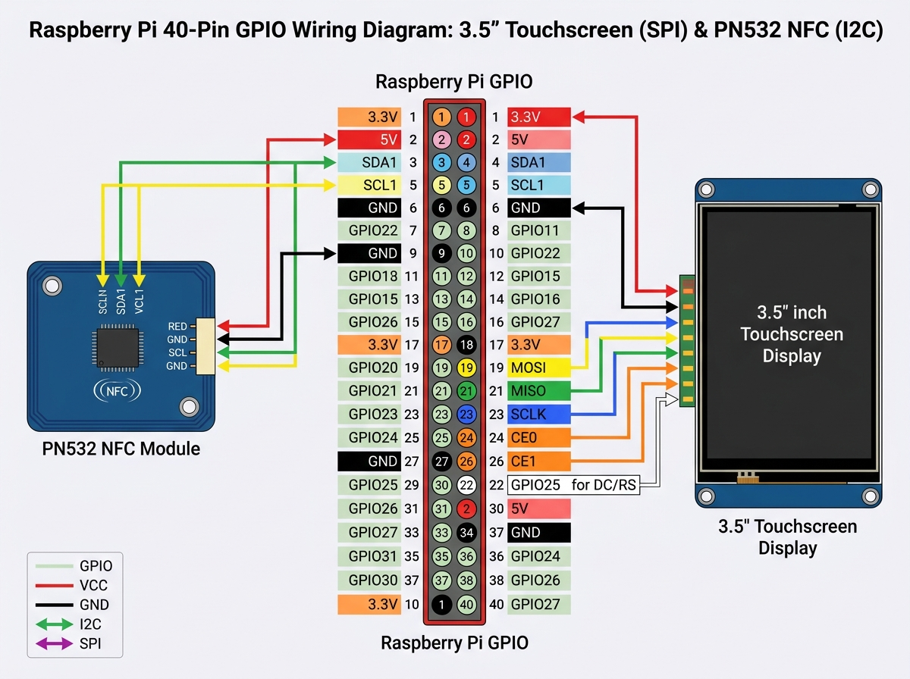
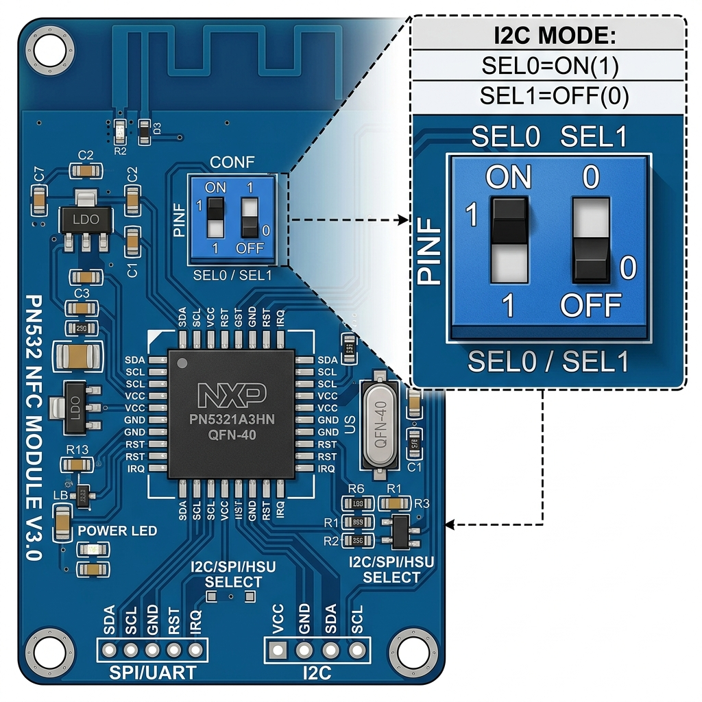

# 🛠️ Raspberry Pi Hardware & OS Setup Guide

Complete step-by-step setup guide for both Raspberry Pi units in the **Kinder-Supermarkt** system, including dual-hardware wiring (3.5" Touchscreen Display + PN532 NFC Reader on the SAME Raspberry Pi #2).

---

## 📐 Architecture Overview

| Device | Role | Recommended OS | Connected Hardware | Default Access URL |
|---|---|---|---|---|
| **Raspberry Pi #1** | Backend Server (Flask, SQLite, Docker) | **Raspberry Pi OS Lite (64-bit)** | USB Thermal Receipt Printer | `http://<pi1-ip>:5050` |
| **Raspberry Pi #2** | NFC Reader & Touchscreen Terminal | **Raspberry Pi OS Desktop (64-bit)** | Touchscreen Display + PN532 NFC Module | `http://<pi1-ip>:5050/terminal` (Kiosk Mode) |
| **Tablet** | Cashier UI | Any OS (iOS / Android / Windows) | Web Browser | `http://<pi1-ip>:5050` |

---

## 🍓 Raspberry Pi #1 — Backend Server Setup

### 1. Flash OS
1. Download & open **Raspberry Pi Imager**.
2. Select OS: **Raspberry Pi OS Lite (64-bit)** (headless, no desktop GUI needed).
3. Click gear icon ⚙️ (OS Customization):
   - Set Hostname: `supermarket-server`
   - Enable SSH (with password or public key)
   - Set username & password (e.g. `pi` / your password)
   - Configure Wi-Fi / LAN settings
   - Set Timezone: `Europe/Berlin`
4. Flash SD card & insert into Pi #1.

### 2. Install Docker & Docker Compose
SSH into Pi #1 (`ssh pi@supermarket-server.local` or via IP):

```bash
# Update system
sudo apt update && sudo apt upgrade -y

# Install Docker via official script
curl -fsSL https://get.docker.com -o get-docker.sh
sudo sh get-docker.sh

# Add user to docker group (run without sudo)
sudo usermod -aG docker $USER

# Install git
sudo apt install -y git

# Reboot to apply group permissions
sudo reboot
```

### 3. Deploy Application
After rebooting and logging back in:

```bash
# Clone the repository
git clone https://github.com/Ayakashi97/kids-supermarket.git
cd kids-supermarket

# Create environment configuration
cp .env.example .env

# Start container via Docker Compose
docker compose up -d
```

### 4. Connect USB Printer
1. Connect Epson (or compatible ESC/POS) USB thermal printer via USB cable.
2. Verify system detects printer:
   ```bash
   ls -l /dev/usb/lp*
   ```
3. If `/dev/usb/lp0` is present, update `.env` if needed:
   ```env
   PRINTER_DEVICE=/dev/usb/lp0
   ```

---

## 💳 Raspberry Pi #2 — NFC Reader & Touchscreen Terminal Setup

### 1. Flash OS
1. Open **Raspberry Pi Imager**.
2. Select OS: **Raspberry Pi OS with Desktop (64-bit)** (desktop environment required for touchscreen kiosk display).
3. Click gear icon ⚙️ (OS Customization):
   - Set Hostname: `supermarket-terminal`
   - Enable SSH
   - Set username & password
   - Configure Wi-Fi / LAN settings
4. Flash SD card & insert into Pi #2.

---

## 🔌 Dual Hardware Wiring Guide: Connecting BOTH 3.5" Touchscreen Display AND PN532 NFC Reader to Pi #2

A 3.5" SPI display plugs directly onto the 40-pin GPIO header. Here is how to connect the PN532 NFC Module to the **SAME Raspberry Pi #2** without hardware pin conflicts.

### Why there is NO GPIO pin conflict:
- **3.5" SPI Display** uses: SPI bus (Pins 19, 21, 23, 24, 26) + Touch IRQ/CS (Pins 11, 18, 22).
- **PN532 NFC Module** uses: **I2C bus (Pins 3 & 5)**.
- Pins 3 (SDA) and 5 (SCL) are **completely unused** by 3.5" SPI displays!



---

### Method A: I2C Mode Wiring (Shared GPIO Header)

Set PN532 DIP Switches to **I2C Mode**: `SEL0 = 1 (HIGH / ON)`, `SEL1 = 0 (LOW / OFF)`.



| PN532 Pin | Raspberry Pi #2 GPIO Pin | Function | Notes |
|---|---|---|---|
| `VCC` | **Pin 2** (5V) or **Pin 4** (5V) or **Pin 17** (3.3V) | Power | Power pin |
| `GND` | **Pin 9** or **Pin 14** or **Pin 20** or **Pin 30** or **Pin 34** | Ground | Ground pin |
| `SDA` | **Pin 3** (GPIO 2 - SDA) | I2C Data | **Not used by 3.5" LCD** |
| `SCL` | **Pin 5** (GPIO 3 - SCL) | I2C Clock | **Not used by 3.5" LCD** |

#### How to physically attach wires when 3.5" LCD is plugged in:
1. **Option 1 (Pass-through / Stacking Header - Easiest)**: Use female-to-male Dupont jumper wires inserted into the top of the 3.5" display header socket at Pins 3, 5, 2, 9.
2. **Option 2 (GPIO Stacking / Breakout Board)**: Place a 40-pin GPIO Stacking Header or GPIO Extension Ribbon Cable between the Raspberry Pi and the 3.5" screen.
3. **Option 3 (Under-PCB Soldering)**: Solder 4 thin wires to the underside of GPIO Pins 3, 5, 5V, GND on the Raspberry Pi PCB.

---

### Method B: USB Serial Mode (Easiest — Zero Header Pin Sharing!)

If you do not want to share GPIO pins, connect the PN532 module to a USB port using a cheap **USB-to-TTL Adapter** (PL2303 / CP2102 / FT232):

Set PN532 DIP Switches to **HSU/UART Mode**: `SEL0 = 0 (LOW)`, `SEL1 = 0 (LOW)`.

| PN532 Pin | USB-to-TTL Serial Adapter Pin |
|---|---|
| `VCC` | `5V` / `3.3V` |
| `GND` | `GND` |
| `TX` | `RX` |
| `RX` | `TX` |

Plug the USB adapter into any USB port on Pi #2! The 40-pin GPIO header remains 100% dedicated to the 3.5" touchscreen.

---

### 🖥️ Touchscreen Setup & White Screen Fix (3.5" XPT2046 Display)

If your 3.5" touchscreen displays a **solid white screen** on boot:

```bash
# SSH into Pi #2
ssh pi@supermarket-terminal.local

# Clone official LCD-show driver repo
git clone https://github.com/goodtft/LCD-show.git
chmod -R 755 LCD-show
cd LCD-show/

# Run installer script for 3.5" XPT2046 SPI display (auto-configures SPI, overlays & reboots)
sudo ./LCD35-show
```

---

### 3. Enable I2C & SPI Interfaces on Pi #2
SSH into Pi #2:

```bash
sudo raspi-config
```
- Go to `Interface Options` → `I2C` → Enable `Yes`.
- Go to `Interface Options` → `SPI` → Enable `Yes`.
- Reboot: `sudo reboot`.

Verify I2C detection:
```bash
sudo apt install -y i2c-tools
sudo i2cdetect -y 1
```
*(You should see `0x24` listed for the PN532 chip)*.

---

### 4. Setup NFC Reader Python Service
SSH into Pi #2:

```bash
# Install git and python dependencies
sudo apt update && sudo apt install -y git python3-pip python3-venv

# Clone project
git clone https://github.com/Ayakashi97/kids-supermarket.git
cd kids-supermarket/nfc_reader

# Create Python virtual environment
python3 -m venv venv
source venv/bin/activate
pip install -r requirements.txt
```

#### Create Systemd Auto-Start Service on Pi #2
Create service file `/etc/systemd/system/supermarkt-nfc.service`:

```ini
[Unit]
Description=Kinder-Supermarkt NFC Reader Service
After=network.target

[Service]
Type=simple
User=pi
WorkingDirectory=/home/pi/kids-supermarket/nfc_reader
ExecStart=/home/pi/kids-supermarket/nfc_reader/venv/bin/python reader.py --server http://supermarket-server.local:5050
Restart=always
RestartSec=5

[Install]
WantedBy=multi-user.target
```

Enable & start the service:
```bash
sudo systemctl daemon-reload
sudo systemctl enable --now supermarkt-nfc
```

---

### 5. Setup Touchscreen Chromium Kiosk Mode (Auto-Launch Terminal on Boot)

Configure Chromium to launch full-screen in Kiosk mode on boot:

#### Method A: Raspberry Pi OS Bookworm (Labwc / Wayland — Default)
Create autostart config file:
```bash
mkdir -p ~/.config/labwc
nano ~/.config/labwc/autostart
```

Paste (replace IP with your Pi #1 IP if needed):
```bash
chromium-browser --kiosk --noerrdialogs --disable-infobars --check-for-update-interval=31536000 http://supermarket-server.local:5050/terminal &
```

#### Method B: Raspberry Pi OS Bullseye / X11 (Default on Pi 3 / Zero)
Create/edit LXDE autostart file:
```bash
mkdir -p ~/.config/lxsession/LXDE-pi
nano ~/.config/lxsession/LXDE-pi/autostart
```

Paste:
```bash
@xset s 30
@xset dpms 30 30 30
@unclutter -idle 0.1 -root
@chromium-browser --kiosk --noerrdialogs --disable-infobars --check-for-update-interval=31536000 http://supermarket-server.local:5050/terminal
```

Reboot Pi #2 (`sudo reboot`). It will now boot directly into the animated **Kinder-Supermarkt Terminal**!

---

## 📱 Tablet Setup (Cashier UI)

1. Connect tablet to the same Wi-Fi network as Pi #1 and Pi #2.
2. Open browser (Safari / Chrome / Firefox).
3. Navigate to `http://supermarket-server.local:5050` (or `http://<pi1-ip-address>:5050`).
4. (Optional) Add web page to Home Screen for a native full-screen app experience.

---

## 🔐 Admin Panel Access

1. Open `http://supermarket-server.local:5050/admin` in any browser.
2. Use the touchscreen **PIN-Pad** to enter the admin PIN (default: `1234`).
3. Manage products, register/edit NFC cards with photos & PINs, configure thermal & PDF receipt layouts, set terminal PIN modes, and adjust display standby timeout (`screen_timeout`).
